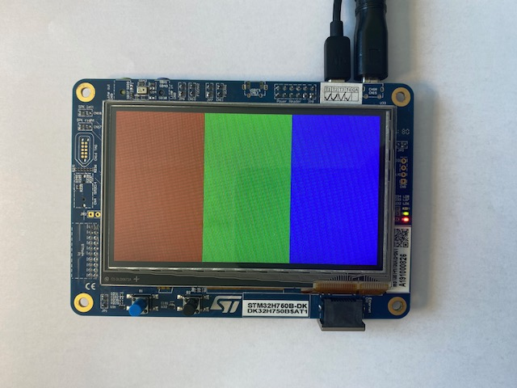

# Hello Display

A minimal STM32 display bring-up project for the **STM32H750B-DK** board.
The application initializes **SDRAM**, configures **LTDC** for the onboard **RK043FN48H** 4.3" RGB panel, and renders three vertical color bars from a framebuffer in external SDRAM.

## Display output



## 1) What does the application do?

The project is a small hardware bring-up and verification application for the STM32H750B-DK display path:

- Initializes the MCU clock tree to run the Cortex-M7 core at **400 MHz**.
- Configures **FMC + SDRAM** using board-compatible parameters.
- Places a **480 x 272 ARGB8888 framebuffer** at address `0xD0000000`.
- Configures **LTDC** with board-compatible timing and pixel clock settings.
- Drives the panel control lines for **reset**, **backlight**, and **panel enable**.
- Draws three vertical bars in **red**, **green**, and **blue**.
- Outputs diagnostic messages via **USART3** at **115200 8N1**.
- Runs an SDRAM self-test during boot before enabling the display pipeline.

## 2) User interactions and use cases

- **Power-on display test:** Flash the firmware to verify that SDRAM, LTDC, and the LCD panel work together.
- **Visual verification:** Confirm correct display output by checking for the three RGB bars.
- **UART diagnostics:** Open the ST-LINK virtual COM port to inspect startup messages and LTDC register values.
- **Board bring-up reference:** Use the project as a starting point for custom framebuffer graphics on the STM32H750B-DK.
- **Regression check:** Reuse the firmware after CubeMX or clock-tree changes to make sure the display path still works.

## 3) Architecture overview

### Components

- **Application entry**
  - `Core/Src/main.c`: startup sequence, SDRAM init sequence, LTDC setup, framebuffer rendering, UART diagnostics.
- **MCU support**
  - `Core/Src/stm32h7xx_hal_msp.c`: peripheral MSP setup, including LTDC GPIOs and LTDC pixel clock (PLL3).
  - `Core/Src/system_stm32h7xx.c`: CMSIS system initialization.
- **Linker configuration**
  - `STM32H750XBHX_FLASH.ld`: flash-based linker script including the external SDRAM framebuffer section.
  - `STM32H750XBHX_RAM.ld`: RAM-based linker script including the external SDRAM framebuffer section.
- **Project generation/build**
  - `hello_display.ioc`: STM32CubeMX project file.
  - `CMakeLists.txt`: VisualGDB/CMake-based build entry point.

### Data flow (boot -> image on panel)

1. `HAL_Init()` and `SystemClock_Config()` set up the MCU and clocks.
2. `MX_FMC_Init()` initializes the SDRAM controller and executes the SDRAM startup sequence.
3. `SDRAM_SelfTest()` verifies that reads and writes to external SDRAM work.
4. `MX_LTDC_Init()` configures LTDC timing and attaches Layer 1 to the framebuffer in SDRAM.
5. `Display_Reset()` and GPIO setup enable the panel hardware.
6. `DrawColorBars()` fills the framebuffer with RGB test bars.
7. `FlushFrameBuffer()` cleans D-Cache so LTDC reads current framebuffer contents from SDRAM.
8. `Display_Backlight_On()` makes the rendered image visible on the panel.

## 4) File responsibilities

| File | Responsibility |
|---|---|
| `README.md` | Project overview, usage notes, architecture summary. |
| `vorlage_README.md` | README structure template used as documentation reference. |
| `CMakeLists.txt` | Build configuration for the VisualGDB/CMake workflow. |
| `hello_display.ioc` | STM32CubeMX configuration for the STM32H750B-DK board. |
| `Core/Src/main.c` | Main application logic, SDRAM test, LTDC setup, framebuffer rendering, UART diagnostics. |
| `Core/Src/stm32h7xx_hal_msp.c` | Peripheral low-level initialization, LTDC GPIO setup, LTDC PLL3 clock configuration. |
| `Core/Inc/main.h` | Pin definitions and shared declarations. |
| `STM32H750XBHX_FLASH.ld` | Main linker script for flash execution; contains `.framebuffer` section in SDRAM. |
| `STM32H750XBHX_RAM.ld` | Alternate RAM linker script; also contains `.framebuffer` section in SDRAM. |
| `requirements/harness.md` | Board and hardware context for the STM32H750B-DK. |
| `requirements/reqirements.md` | Implementation guidance and reference values for LTDC, SDRAM, and framebuffer setup. |
| `images/display_shows_three_columns.jpeg` | Photo of the successful RGB bar output on the target display. |

## 5) Build and run

### Requirements

- **STM32H750B-DK** board
- ARM GNU toolchain
- CMake 3.15+
- VisualGDB-compatible build environment
- ST-LINK connection for flashing and UART access

### Build

```bash
cmake --build build/VisualGDB/Debug
```

The build produces:

- `build/VisualGDB/Debug/hello_display`
- `build/VisualGDB/Debug/hello_display.bin`
- `build/VisualGDB/Debug/hello_display.map`

### Flash and verify

1. Build the project.
2. Flash the generated firmware to the **STM32H750B-DK**.
3. Open the **ST-LINK virtual COM port** with:
   - Baudrate: `115200`
   - Format: `8N1`
4. Reset the board.
5. Verify:
   - UART shows the diagnostic boot messages.
   - The display shows three vertical bars: **red**, **green**, **blue**.

### Expected UART output

```text
hello_display diagnostic boot
SystemCoreClock=400000000 Hz
SDRAM self-test passed
LTDC SSCR=0x00280009 BPCR=0x002A000B AWCR=0x0215011B TWCR=0x022A011D GCR=0x00002221
LTDC Layer1 CFBAR=0xD0000000 CFBLR=0x07800787 CFBLNR=0x00000110 CR=0x00000001
Display path enabled, framebuffer=0xd0000000
```

### Troubleshooting

- If the display stays white, check panel control GPIOs first, especially the panel-enable path.
- In this project, a critical issue was that `LCD_DISPD7` must be configured as an **output** and driven **high**.
- If UART reports `SDRAM self-test FAILED`, focus on **FMC/SDRAM** configuration before debugging LTDC.
- If UART looks correct but the image is wrong, verify framebuffer cache maintenance and LTDC timing values.

## 6) Technical notes

- Framebuffer format: **ARGB8888**
- Resolution: **480 x 272**
- Framebuffer base address: `0xD0000000`
- SDRAM section alignment: **32 bytes**
- LTDC pixel clock source: **PLL3**
- Verified startup clock: **400 MHz system clock**

## License

This project is licensed under the terms of the [](https://opensource.org/licenses/MIT)
